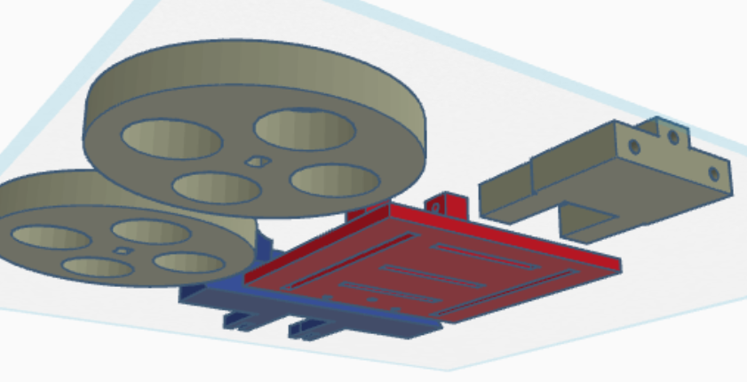

# Robot Wrestling Project Journal

## Developer: Mina Romany Mina Habib  
**Duration**: 01/07/2025 – 12/07/2025  
**Total Time Spent**: 68 hours  
**Description**: An autonomous robot designed for competitive wrestling-style matches. Focus areas included high-torque movement, intelligent opponent detection, sensor integration, and adaptive behavior control through real-time decision-making algorithms.

---

### 01/07/2025  
I began the combat robotics part of my project by drawing the base frame and then thinking about possible layouts of the arena. Not only was it important to see the physical structure, how the robot would walk and move inside a confined space mattered. I have effectively used some hours of the day to research about torque and gear ratios in an effort to get the maximum combination of pushing and agility. In the process, I have also collected sources on effective autonomous wrestling strategies as I dreamed to combine theoretical AI methods with the real physics. This was very inspiring and energizing beginning to this sub-project.

---

### 02/07/2025  
My ideas, now more solid, were followed next by creating the complete 3D chassis architecture. I applied CAD tools in modeling how weight distribution could influence balance and turning momentum. Much time was spent on trying numerous combinations that would withstand pressure, not only regarding impact resistance but also fluid flow mobility. That was a problem of stability versus responsiveness. Towards the late hours of the same day, I had a working model and was quite sure that I could use it as the supporting structure of the robot.

---

### 03/07/2025  
This day was sensor day. The last component of the design would be where to place the sensors, which I finished after conducting research to get the most appropriate combination of IR and ultrasonic modules. I listened to their effective range, their blind spots and detection angles. It took quite some experimentation on paper before I did some hardware commitments. The objective was simple: do away with blind spots and make it such that the robot would never lose sight of its opponent no matter what the angle of attack would be. A coming NP session, shorter than most, but a very technical one.

---

### 04/07/2025  
Six hours of concentrated work imitating the logic of detecting opponents was spent. I simulated the imminent moves that the robot would issue when in the presence of a nearby rival using mock input from ultrasonic and IR sensors. I, also, started conducting physical move tests, adjusting the motors to behave according to changes in distance. Arguably the most important milestone in the recent past was the integration of motor control with an edge detection failsafe, this would ensure that the robot would not drive off the field in case of a match. This was an interesting and hard debugging experience.

---

### 05/07/2025  
Today my attention was drawn to the power system. I managed to figure out the current draw of each motor running at full load and this assisted me to determine the amount of power the system would use in a typical five-minute match. Based on that data, I modeled the rate of battery drain to make sure that the robot would be operational at its full capacity until the end. I also used this time to record any pin mappings, places to power all my devices and do the pin and power distribution in a consistent manner across the hardware and the codebase.

---

### 06/07/2025  
It was the first great meeting-day. I started assembling all the internal devices into the printed frame of 3D. Through this I was able to sample sensor behavior in real world motion, amongst other things, I was able to monitor their behavior to any interference or strange movement under the influence of vibration. Like this, the IR sensors identified as the most sensitive as anticipated. All the modules were calibrated to the light in different environments, so they are reliable both in bright and dark environments. Physically I was knackered at the end of it, but seeing the robot in its form was an amazing experience.

---

### 07/07/2025  
This was the day of finishing. I also optimized ultrasonic sensor code because noise filtering algorithms will help to remove false amount of readings due to ambient sound or reflections. I also introduced an edge triggered stop /reset feature that automatically stops the functioning of the robot in event of some failure conditions. Lastly, I conducted a sequence of three controlled fight simulation, where I watched how the robot performed when put to pressure like it is in battle. It was this record-keeping of behavior that helped me to notice minute adjustments to make later matches.

---

### 08/07/2025  
Today, I focused on the behaviors transition, coming up with routines of three important states: search, engage and push. The robot was to shift between seeking an opponent, seeking a jump to intercept, and then pushing on without torque limitations. I adjusted the angles to take sharp turns and intensified acceleration lags so that accidents can be prevented during swift movements. The best moment was the testing of the response time of the system getting out of the aggressive mode into the evasive mode once the opponent reversed or countered. It was tantamount to programming an animal with instincts.

---

### 09/07/2025  
Today, aesthetics and functionality came together because I added RGB LED logic to indicate the fighting state of this robot. I coded the LEDs to cycle through different colors depending on what mode you are in e.g. red when you push, blue when searching, and yellow when you were doing evasive maneuvers. To my surprise, this also proved quite useful when debugging and tracking in matches. I also recorded all instances of RGB behavior so that I could analyse in the future how the robot responded in real time during testing or presentations.
---

### 10/07/2025  
Documentation phase was started fully. I had made notes on how each submodule worked including diagrams of how the data flowed, how we connected the pins and how we decided what to do. I implemented variable input settings, where I tested the model on how the robot will behave in various different environments of the arena (e.g. high reflective walls, ambient light, size of opponent). The internal wiring layout was modified also to fit in small spaces to minimize cross-interference and enhance safety.

---

### 11/07/2025  
When the finish line approached, I collected all the media materials to include in the final presentation: photos, some video recordings, schematic wiring drawing and 3D renders. I sorted the Bill of Materials (BOM), reviewed every single price, and also left links to vendors so that, in case this project is to be replicated or scaled in the future, there will be a source of materials. I have also devoted some time into cleaning (physically) as well as polishing the robot body to ensure that it is presentable and professional. It was a beautyful and visual finale of all the serious technical workز
---

### 12/07/2025  
During the last day, I completely worked on verification and submission. I went through the sourcing information of each component again to make sure that all of it was well accounted. Then I read this journal and README file one more time to find any typo or omitted documentation. I checked that links are active, diagrams are understandable and all material was provided on the correct form. This was a muted yet rewarding conclusion to a real interesting and learning build-up.

---

## Images
- 
- 
### Code
-  
-  
-  
-  
-  
-  
-  
-  
-  
-  
-  
-  
-  
-  
-  
-  
-  
-  
-  
- 
### Circuits
-  
-  
-  
-  
-  
-  
-  
-  
-  
-  
-  
-  
-  
-  
- 

