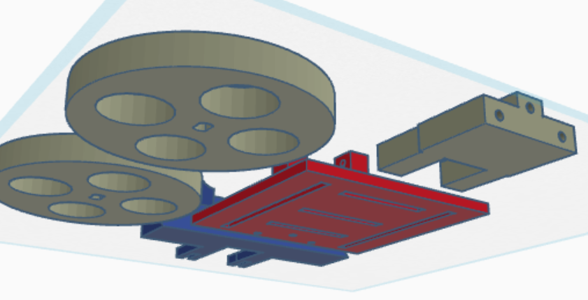
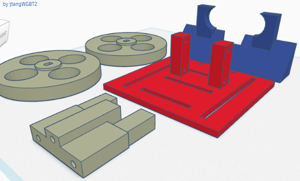
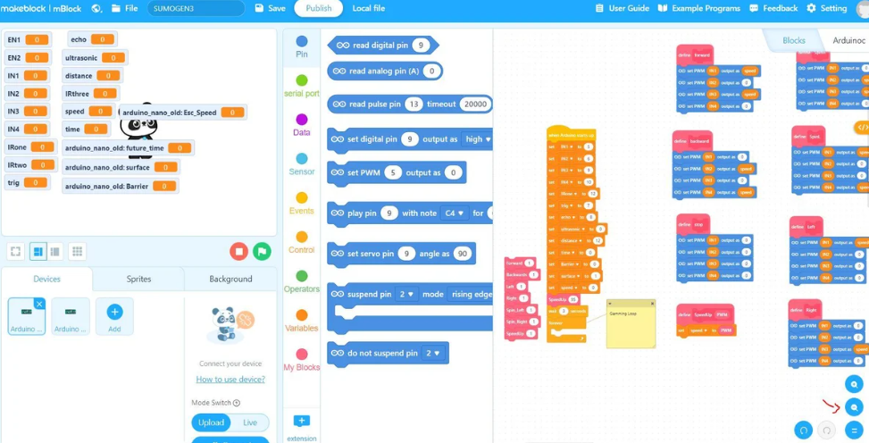
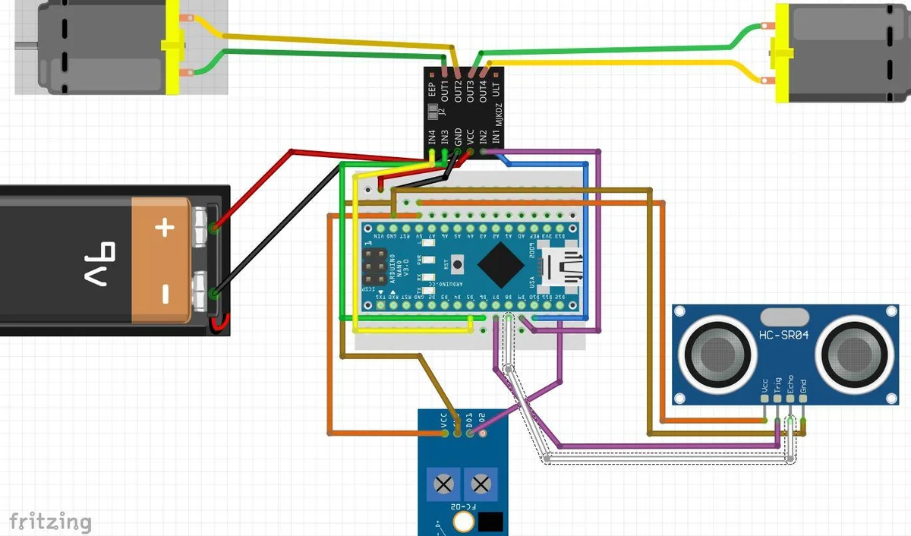

# Fighting Robota

### Description  
Fighting Robota is an autonomous wrestling robot designed to engage in battles without any human control. Using a 32-bit Arduino Due for fast processing, dual DRV8835 motor drivers, and a powerful sensor array, the bot detects opponents and arena edges to maneuver strategically and push rivals off the ring.

### Why I Made the Project  
I’ve always been fascinated by combat robotics but wanted to push beyond the simplicity of sumo robot kits. My goal was to build a faster, smarter robot with better autonomy and mechanical advantage through stronger motors, optimized sensing, and a customized 3D-printed chassis—all while learning about embedded control, simulation, and hardware performance limits.

---

### Screenshots  
- 
- 
- 
- 

---

### Bill of Materials (BOM)

| # | Component                           | Description                                      | Price (USD) | Source |
|---|-------------------------------------|--------------------------------------------------|-------------|--------|
| 1 | Arduino Due (32-bit)               | Central microcontroller                          | $61.67      | [Link](https://store.arduino.cc/products/arduino-due) |
| 2 | DRV8835 Dual Motor Driver          | Smooth DC motor control                          | $19         | — |
| 3 | 2× DC Planetary Gear Motors        | 200 RPM, high torque                             | $35         | — |
| 4 | HC-SR04 Ultrasonic Sensor          | Distance detection                               | $18         | — |
| 5 | 2× IR Proximity Sensor Modules     | Opponent and edge detection                      | $22         | — |
| 6 | 7.4 V 2000 mAh LiPo Battery + BMS  | Lightweight, long runtime                        | $38         | — |
| 7 | Mini Breadboard + Jumper Kit       | Organized internal wiring                        | $18         | — |
| 8 | 3D-Printed ABS Chassis             | Custom structural frame                          | $10         | — |
| 9 | Rubber Wheels + Traction Bands     | Grip and stability                               | $15         | — |
|10 | USB Mini Cable + Connectors        | Power/programming                                | $12         | — |
|11 | LiPo Charger (balanced)            | Efficient battery management                     | $27         | — |
|12 | Power Switch + Fuse Assembly       | Safety and manual control                        | $20         | — |
|13 | RGB LED Light Bar                  | Visual feedback and effects                      | $11         | [Link](https://www.amazon.eg/-/en/10M-70W-Light-Remote-Control/dp/B09S41M1LZ) |
|   | **Total**                          |                                                  | **$306.67** |        |
